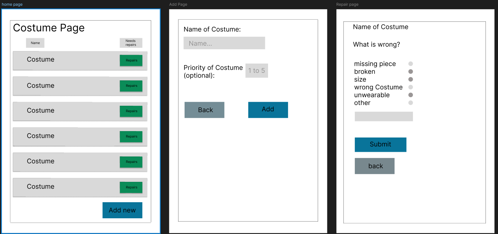

# Sprint 1 - A Working UI Prototype

## Sprint Goals

Develop a prototype that simulates the key functionality of the system, then test and refine it so that it can serve as the model for the next phase of development in Sprint 2.

[Figma](https://www.figma.com/) is used to develop the prototype.

---

## Initial Database Design

The design is gonna look something like below but I will be changing lots to fit what the user wants it to look and be like. 

---

## UI 'Flow'

The first stage of prototyping was to explore how the UI might 'flow' between states, based on the required functionality.

This Figma demo shows the initial design for the UI 'flow':

**FIGMA FLOW - **

### Testing

My tester/end-user said that they wanted to change the home page where each garment shows all the information they need e.g. the priority so they can know what are more important.

### Changes / Improvements

I changed how each garment now displays if it is complete, the priority and the date it was added. I also changed how the layout looked

*IMPROVED FIGMA FLOW - <iframe style="border: 1px solid rgba(0, 0, 0, 0.1);" width="800" height="450" src="https://embed.figma.com/design/Nn3usXNZClJvl4RwRhtf06/Untitled?node-id=0-1&embed-host=share" allowfullscreen></iframe>*

---

## Initial UI Prototype

The next stage of prototyping was to develop the layout for each screen of the UI.

This Figma demo shows the initial layout design for the UI:

*FIGMA PROTOTYPE - <iframe style="border: 1px solid rgba(0, 0, 0, 0.1);" width="800" height="450" src="https://embed.figma.com/design/Nn3usXNZClJvl4RwRhtf06/Untitled?node-id=0-1&embed-host=share" allowfullscreen></iframe>*

### Testing

My end-user tested and had a look at the prototype i made and decided she didnt like having three pages and asked if the home page could just have the adding garment section below instead of a whole new page. Also to remove the big green button and put a small button or link below that goes straight to the repairs.

### Changes / Improvements

I changed it so the add new button wouldnt bring the user to a new page and just had the name and priority right below. Also I changed some of the design to fit how the end-user asked.

*FIGMA IMPROVED PROTOTYPE - PLACE THE FIGMA EMBED CODE HERE - MAKE SURE IT IS SET SO THAT EVERYONE CAN ACCESS IT*

---

## Refined UI Prototype

Having established the layout of the UI screens, the prototype was refined visually, in terms of colour, fonts, etc.

This Figma demo shows the UI with refinements applied:

*FIGMA REFINED PROTOTYPE - PLACE THE FIGMA EMBED CODE HERE - MAKE SURE IT IS SET SO THAT EVERYONE CAN ACCESS IT*

### Testing

Replace this text with notes about what you did to test the UI flow and the outcome of the testing.

### Changes / Improvements

Replace this text with notes any improvements you made as a result of the testing.

*FIGMA IMPROVED REFINED PROTOTYPE - PLACE THE FIGMA EMBED CODE HERE - MAKE SURE IT IS SET SO THAT EVERYONE CAN ACCESS IT*

---

## Sprint Review

Replace this text with a statement about how the sprint has moved the project forward - key success point, any things that didn't go so well, etc.

